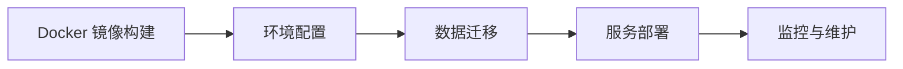

# Poor Server STL 项目文档中心

> 完整的项目文档导航，帮助你快速找到所需信息

---

## ?? 文档目录

### ?? 快速开始

| 文档 | 说明 | 适合人群 |
|------|------|---------|
| [项目介绍](../README.md) | 项目概述、目标和特性 | 所有人 |
| [环境配置](./项目配置与运行/README.md) | 开发环境搭建完整指南 | 新手开发者 |
| [快速部署](./项目配置与运行/docker/README.md) | 使用 Docker 快速启动项目 | 想快速体验的开发者 |

---

### ??? 开发环境配置

#### Windows 开发

| 文档 | 内容 |
|------|------|
| [Windows 开发环境](./项目配置与运行/windows开发工具与环境配置.md) | Visual Studio 2022, vcpkg, MySQL, Redis |
| [WSL2 开发环境](./项目配置与运行/linux开发工具与环境配置.md) | WSL2 + Ubuntu 22.04 配置 |
| [编译运行指南](./项目配置与运行/编译及运行项目.md) | 编译步骤和常见问题 |

#### Docker 容器化部署

| 文档 | 用途 | 耗时 |
|------|------|------|
| [Docker 环境配置](./项目配置与运行/docker/Docker_环境配置指南.md) | 安装 Docker Desktop | 10 分钟 |
| [Docker 能保存什么](./项目配置与运行/docker/Docker_能保存什么.md) ? | 理解 Docker 原理 | 15 分钟 |
| [Docker 部署指南](./项目配置与运行/docker/Docker_部署指南.md) | 一键部署项目 | 5 分钟 |
| [Docker 环境共享](./项目配置与运行/docker/Docker_环境共享指南.md) | 团队协作方式 | 10 分钟 |
| [Docker 快速参考](./项目配置与运行/docker/Docker_快速参考.md) | 常用命令速查 | 随时查阅 |

---

### ??? 架构与设计

#### 服务器架构

| 文档 | 说明 |
|------|------|
| [服务器架构总览](./server/readme.md) | 分布式架构设计 |
| [服务器模型](./server/model.md) | 各服务器职责和通信方式 |
| [第三方库说明](./server/library.md) | 使用的第三方库及作用 |

#### Skynet 框架集成

| 文档 | 适合人群 | 学习时间 |
|------|---------|---------|
| [Skynet 文档导航](./skynet/README_skynet.md) | 所有人 | 5 分钟 |
| [Skynet 快速入门](./skynet/skynet_quickstart.md) | 初学者 | 2-3 小时 |
| [Skynet 核心概念](./skynet/skynet_concepts.md) | 进阶开发者 | 4-6 小时 |
| [Skynet API 参考](./skynet/skynet_api_reference.md) | 日常查阅 | 随时 |
| [Skynet Protobuf 集成](./skynet/QUICKSTART.md) | Protobuf 使用者 | 30 分钟 |
| [Skynet 项目结构](./skynet/PROJECT_STRUCTURE.md) | 项目维护者 | 15 分钟 |

---

### ?? 数据库设计

#### 数据库总览

| 文档 | 说明 |
|------|------|
| [数据库架构](./server/数据库/数据库总览.md) | 多数据库设计方案 |
| [用户数据库](./server/数据库/poor_users.md) | 用户、账号、登录相关 |
| [文件数据库](./server/数据库/poor_file.md) | 网盘文件存储 |
| [炉石数据库](./server/数据库/hearthstone.md) | 游戏数据 |

#### 业务模块

| 文档 | 说明 |
|------|------|
| [炉石传说模块](./server/炉石传说/hearthstone.md) | 游戏业务逻辑 |
| [成就系统](./server/炉石传说/achievement.md) | 成就功能设计 |
| [玩家数据](./server/炉石传说/user_play.md) | 玩家游戏数据 |

---

### ?? 开发规范

#### 代码规范

| 文档 | 内容 |
|------|------|
| [C++ 代码规范](./layout/cpp_layout.md) | 命名、格式、注释规范 |
| [C++ 安全指南](./layout/cpp_security.md) | 代码安全最佳实践 |
| [编码格式规范](./layout/layout.md) | 文件编码和格式要求 |

#### 通用组件

| 文档 | 说明 |
|------|------|
| [日志系统](./common/log.md) | 日志模块使用说明 |

---

### ?? API 接口

| 文档 | 说明 |
|------|------|
| [接口文档示例](./server/接口文档/示例文档.md) | API 接口文档模板 |

---

## ??? 学习路线

### 新手入门（第 1 周）


**推荐顺序：**
1. [项目介绍](../README.md) （10 分钟）
2. [Docker 快速部署](./项目配置与运行/docker/README.md) （15 分钟）
   - 或 [Windows 环境配置](./项目配置与运行/windows开发工具与环境配置.md) （2-3 天）
3. [服务器架构](./server/readme.md) （30 分钟）
4. [数据库设计](./server/数据库/数据库总览.md) （1 小时）
5. [C++ 代码规范](./layout/cpp_layout.md) （1 小时）

### 进阶开发（第 2-4 周）


**推荐顺序：**
1. [Skynet 快速入门](./skynet/skynet_quickstart.md) （2-3 小时）
2. [Skynet 核心概念](./skynet/skynet_concepts.md) （4-6 小时）
3. [Skynet Protobuf 集成](./skynet/QUICKSTART.md) （30 分钟）
4. [第三方库说明](./server/library.md) （1 小时）
5. [业务模块开发](./server/炉石传说/hearthstone.md) （持续学习）

### 生产部署（第 5 周+）



**推荐顺序：**
1. [Docker 能保存什么](./项目配置与运行/docker/Docker_能保存什么.md) （15 分钟）
2. [Docker 部署指南](./项目配置与运行/docker/Docker_部署指南.md) （30 分钟）
3. [Docker 环境共享](./项目配置与运行/docker/Docker_环境共享指南.md) （20 分钟）

---

## ?? 快速查找

### 我想要...

| 需求 | 推荐文档 |
|------|---------|
| ?? **立即开始项目** | [Docker 快速部署](./项目配置与运行/docker/README.md) |
| ??? **配置 Windows 环境** | [Windows 开发环境](./项目配置与运行/windows开发工具与环境配置.md) |
| ?? **配置 Linux/WSL2** | [Linux 开发环境](./项目配置与运行/linux开发工具与环境配置.md) |
| ?? **了解 Docker** | [Docker 能保存什么](./项目配置与运行/docker/Docker_能保存什么.md) |
| ??? **理解架构设计** | [服务器架构](./server/readme.md) |
| ?? **学习 Skynet** | [Skynet 文档导航](./skynet/README_skynet.md) |
| ?? **查看数据库设计** | [数据库总览](./server/数据库/数据库总览.md) |
| ?? **查询代码规范** | [C++ 代码规范](./layout/cpp_layout.md) |
| ?? **查看 API 接口** | [接口文档示例](./server/接口文档/示例文档.md) |
| ?? **查询 Skynet API** | [Skynet API 参考](./skynet/skynet_api_reference.md) |
| ?? **解决编译问题** | [编译运行指南](./项目配置与运行/编译及运行项目.md) |
| ?? **Docker 命令速查** | [Docker 快速参考](./项目配置与运行/docker/Docker_快速参考.md) |

---

## ?? 文档分类

### 按主题分类

#### ?? 入门必读
- [项目介绍](../README.md)
- [环境配置总览](./项目配置与运行/README.md)
- [Docker 快速开始](./项目配置与运行/docker/README.md)
- [服务器架构](./server/readme.md)

#### ??? 开发环境
- [Windows 配置](./项目配置与运行/windows开发工具与环境配置.md)
- [Linux/WSL2 配置](./项目配置与运行/linux开发工具与环境配置.md)
- [Docker 容器化](./项目配置与运行/docker/)
- [编译运行](./项目配置与运行/编译及运行项目.md)

#### ??? 架构设计
- [服务器架构](./server/readme.md)
- [服务器模型](./server/model.md)
- [数据库设计](./server/数据库/)
- [Skynet 集成](./skynet/)

#### ?? 开发规范
- [C++ 规范](./layout/cpp_layout.md)
- [安全规范](./layout/cpp_security.md)
- [编码规范](./layout/layout.md)

#### ?? 框架学习
- [Skynet 入门](./skynet/skynet_quickstart.md)
- [Skynet 概念](./skynet/skynet_concepts.md)
- [Skynet API](./skynet/skynet_api_reference.md)
- [Protobuf 集成](./skynet/QUICKSTART.md)

#### ?? Docker 专题
- [Docker 环境配置](./项目配置与运行/docker/Docker_环境配置指南.md)
- [Docker 原理解析](./项目配置与运行/docker/Docker_能保存什么.md)
- [Docker 部署实战](./项目配置与运行/docker/Docker_部署指南.md)
- [Docker 团队协作](./项目配置与运行/docker/Docker_环境共享指南.md)
- [Docker 命令速查](./项目配置与运行/docker/Docker_快速参考.md)

---

## ?? 按学习时间分类

### ? 5-15 分钟
- [项目介绍](../README.md)
- [Docker 快速部署](./项目配置与运行/docker/README.md)
- [Skynet 文档导航](./skynet/README_skynet.md)
- [Docker 能保存什么](./项目配置与运行/docker/Docker_能保存什么.md)
- [Skynet Protobuf 快速开始](./skynet/QUICKSTART.md)

### ? 30 分钟 - 1 小时
- [服务器架构](./server/readme.md)
- [数据库设计](./server/数据库/数据库总览.md)
- [C++ 代码规范](./layout/cpp_layout.md)
- [Docker 部署指南](./项目配置与运行/docker/Docker_部署指南.md)
- [第三方库说明](./server/library.md)

### ?? 2-3 小时
- [Skynet 快速入门](./skynet/skynet_quickstart.md)
- [C++ 安全指南](./layout/cpp_security.md)
- [编译运行指南](./项目配置与运行/编译及运行项目.md)

### ?? 4-6 小时
- [Skynet 核心概念](./skynet/skynet_concepts.md)
- [业务模块学习](./server/炉石传说/)

### ??? 2-3 天
- [Windows 完整环境配置](./项目配置与运行/windows开发工具与环境配置.md)
- [Linux/WSL2 完整配置](./项目配置与运行/linux开发工具与环境配置.md)

---

## ?? 角色导航

### ????? 后端开发者
1. [环境配置](./项目配置与运行/)
2. [服务器架构](./server/readme.md)
3. [数据库设计](./server/数据库/)
4. [C++ 规范](./layout/)
5. [Skynet 学习](./skynet/)

### ?? DevOps 工程师
1. [Docker 环境配置](./项目配置与运行/docker/Docker_环境配置指南.md)
2. [Docker 部署](./项目配置与运行/docker/Docker_部署指南.md)
3. [Docker 环境共享](./项目配置与运行/docker/Docker_环境共享指南.md)
4. [编译运行](./项目配置与运行/编译及运行项目.md)

### ?? 游戏开发者
1. [Skynet 快速入门](./skynet/skynet_quickstart.md)
2. [Skynet 核心概念](./skynet/skynet_concepts.md)
3. [Protobuf 集成](./skynet/QUICKSTART.md)
4. [业务模块](./server/炉石传说/)

### ?? 数据库工程师
1. [数据库总览](./server/数据库/数据库总览.md)
2. [用户数据库](./server/数据库/poor_users.md)
3. [文件数据库](./server/数据库/poor_file.md)
4. [游戏数据库](./server/数据库/hearthstone.md)

### ?? 新手开发者
1. [项目介绍](../README.md) - 5 分钟
2. [Docker 快速部署](./项目配置与运行/docker/README.md) - 15 分钟
3. [服务器架构](./server/readme.md) - 30 分钟
4. [代码规范](./layout/cpp_layout.md) - 1 小时
5. [Skynet 入门](./skynet/skynet_quickstart.md) - 2-3 小时

---

## ?? 文档统计

| 分类 | 文档数量 | 说明 |
|------|---------|------|
| 环境配置 | 9 篇 | Windows, Linux, Docker |
| 架构设计 | 3 篇 | 服务器架构和模型 |
| 数据库 | 7 篇 | 数据库设计和业务模块 |
| 开发规范 | 4 篇 | 代码规范和安全指南 |
| Skynet | 10 篇 | Skynet 学习和集成 |
| Docker | 5 篇 | Docker 容器化专题 |
| **总计** | **38 篇** | 完整文档体系 |

---

## ?? 相关资源

### 项目资源
- **GitHub 仓库**: [poor_server_stl](https://github.com/rhfgxg/poor_server_stl)
- **主要文件**: [README.md](../README.md)
- **文件树**: [tree.txt](../tree.txt)

### 外部资源
- **Skynet 官方**: [cloudwu/skynet](https://github.com/cloudwu/skynet)
- **Docker 文档**: [docs.docker.com](https://docs.docker.com/)
- **vcpkg 文档**: [vcpkg.io](https://vcpkg.io/)
- **gRPC 文档**: [grpc.io](https://grpc.io/)
- **Protobuf 文档**: [protobuf.dev](https://protobuf.dev/)

---

## ?? 使用建议

### 文档阅读顺序

#### 完全新手（推荐）
```
1. 项目介绍 (5分钟)
   ↓
2. Docker 快速部署 (15分钟)
   ↓
3. 服务器架构 (30分钟)
   ↓
4. 代码规范 (1小时)
   ↓
5. Skynet 入门 (2-3小时)
   ↓
6. 深入学习各模块
```

#### 有经验开发者
```
1. 项目介绍 + 架构设计 (30分钟)
   ↓
2. 环境配置（选择 Windows/Linux/Docker）
   ↓
3. Skynet 核心概念 (4-6小时)
   ↓
4. 数据库设计 + API 接口
   ↓
5. 开始开发
```

### 查阅技巧

1. **使用 Ctrl+F** 搜索关键词
2. **收藏常用文档** 便于快速访问
3. **按需学习** 不必一次性阅读所有文档
4. **结合实践** 边学边做效果更好

---

## ?? 文档更新

### 最新更新
- **2024-11-25**: 创建文档中心导航
- **2024-11-25**: 整理所有文档，去除重复内容
- **2024-11-25**: 添加 Docker 专题文档
- **2024-11-25**: 完善 Skynet 学习路径

### 贡献文档
发现文档有错误或需要补充？
1. 提交 Issue 描述问题
2. 发起 Pull Request 修改
3. 联系项目维护者

---

## ? 常见问题

### Q: 文档太多，不知道从哪开始？
**A**: 跟随[学习路线](#学习路线)，从"新手入门"开始。

### Q: 我只想快速体验项目？
**A**: 直接看 [Docker 快速部署](./项目配置与运行/docker/README.md)，15 分钟搞定。

### Q: Docker 和传统方式有什么区别？
**A**: 参见 [Docker 能保存什么](./项目配置与运行/docker/Docker_能保存什么.md)，详细对比两种方式。

### Q: Skynet 文档很多，应该看哪个？
**A**: 从 [Skynet 文档导航](./skynet/README_skynet.md) 开始，有清晰的学习路径。

### Q: 如何快速查找 API？
**A**: 使用 [Skynet API 参考](./skynet/skynet_api_reference.md) 或 [Docker 快速参考](./项目配置与运行/docker/Docker_快速参考.md)。

---

## ?? 开始你的旅程

选择适合你的起点：

```bash
# ?? 想立即体验？
→ Docker 快速部署 (15 分钟)

# ??? 想配置开发环境？
→ Windows/Linux 环境配置 (2-3 天 或 15 分钟 Docker)

# ??? 想了解架构？
→ 服务器架构设计 (30 分钟)

# ?? 想学习 Skynet？
→ Skynet 快速入门 (2-3 小时)

# ?? 想看数据库设计？
→ 数据库总览 (1 小时)
```

**现在就开始吧！** ??

---

**最后更新**: 2024-11-25  
**维护者**: Poor Server STL Team  
**问题反馈**: [GitHub Issues](https://github.com/rhfgxg/poor_server_stl/issues)
