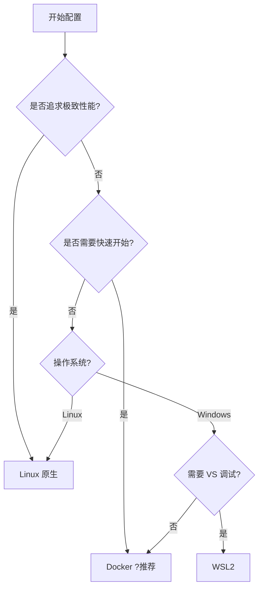

# 项目环境配置总览

> 本文档提供项目环境配置的完整导航，帮助你选择最适合的配置方式

---

## ?? 选择你的配置方式

### 快速对比

| 方式 | 耗时 | 难度 | 推荐度 | 适合人群 |
|------|------|------|--------|---------|
| **Docker 容器化** | 15 分钟 | ? | ????? | 所有人，尤其是新手 |
| **Windows 开发** | 2-3 天 | ???? | ??? | Windows 用户 |
| **WSL2 开发** | 1-2 天 | ??? | ???? | Windows + Linux 双环境 |
| **Linux 开发** | 1-2 天 | ??? | ???? | Linux 用户 |

---

## ?? 方式 1: Docker 容器化（推荐）?

### 优势
- ? **配置时间**: 15 分钟
- ? **环境一致**: 100% 相同
- ? **一键启动**: `docker compose up -d`
- ? **无需安装**: MySQL, Redis 自动配置
- ? **易于分享**: 团队环境完全一致

### 适合人群
- ?? 新手开发者
- ?? 团队协作
- ?? 快速体验项目
- ?? 需要频繁切换环境

### 快速开始

```bash
# 1. 安装 Docker Desktop (10 分钟)
# 下载: https://www.docker.com/products/docker-desktop/

# 2. 启动项目 (5 分钟)
git clone https://github.com/rhfgxg/poor_server_stl.git
cd poor_server_stl
docker compose up -d

# ? 完成！
```

### 详细文档
- **[Docker 环境配置指南](./docker/Docker_环境配置指南.md)** - Docker Desktop 安装
- **[Docker 能保存什么](./docker/Docker_能保存什么.md)** - 理解 Docker 原理 ?
- **[Docker 部署指南](./docker/Docker_部署指南.md)** - 实战部署
- **[Docker 环境共享指南](./docker/Docker_环境共享指南.md)** - 团队协作
- **[Docker 快速参考](./docker/Docker_快速参考.md)** - 命令速查

---

## ?? 方式 2: Windows 原生开发

### 优势
- ? 直接在 Windows 开发
- ? Visual Studio 完整支持
- ? 无需虚拟化
- ? 调试体验最佳

### 劣势
- ? 配置复杂（2-3 天）
- ? 依赖手动安装
- ? 环境差异大
- ? 可能遇到版本冲突

### 适合人群
- ?? 纯 Windows 用户
- ??? 需要 Visual Studio 调试
- ?? 电脑配置较低（不适合虚拟化）

### 配置步骤

```powershell
# 1. 安装 Visual Studio 2022
# 2. 安装 scoop (软件包管理)
# 3. 安装 MySQL, Redis
scoop install mysql redis

# 4. 安装 vcpkg
git clone https://github.com/microsoft/vcpkg
.\vcpkg\bootstrap-vcpkg.bat

# 5. 安装项目依赖
cd poor_server_stl
vcpkg install

# 6. 编译项目
cmake -B build
cmake --build build
```

### 详细文档
- **[Windows 开发环境配置](./windows开发工具与环境配置.md)** - 完整配置步骤
- **[编译运行指南](./编译及运行项目.md)** - 编译和常见问题

---

## ?? 方式 3: WSL2 开发（推荐 Windows 用户）?

### 优势
- ? Windows + Linux 双环境
- ? 接近原生 Linux 性能
- ? Visual Studio 远程开发
- ? 资源占用低

### 劣势
- ?? 配置中等复杂（1-2 天）
- ?? 需要 Windows 10/11 专业版
- ?? 需要 BIOS 虚拟化支持

### 适合人群
- ?? Windows 用户想用 Linux 工具
- ??? 需要 VS 远程调试
- ?? 想要更好的性能

### 配置步骤

```powershell
# 1. 启用 WSL2
wsl --install -d Ubuntu-22.04

# 2. 进入 WSL2
wsl

# 3. 安装开发工具
sudo apt update
sudo apt install build-essential cmake ninja-build

# 4. 安装 vcpkg
git clone https://github.com/microsoft/vcpkg
cd vcpkg && ./bootstrap-vcpkg.sh

# 5. 配置 Visual Studio 连接 WSL2
# 参见详细文档
```

### 详细文档
- **[WSL2 开发环境配置](./linux开发工具与环境配置.md)** - 完整 WSL2 配置
- **[编译运行指南](./编译及运行项目.md)** - WSL2 编译步骤

---

## ?? 方式 4: Linux 原生开发

### 优势
- ? 最佳性能
- ? 完全的 Linux 环境
- ? 包管理器方便
- ? 适合生产环境

### 劣势
- ?? 配置中等复杂（1-2 天）
- ?? 需要熟悉 Linux 命令
- ?? 调试工具不如 VS

### 适合人群
- ?? Linux 用户
- ??? 服务器部署
- ?? 追求性能

### 配置步骤（Ubuntu 22.04）

```bash
# 1. 安装开发工具
sudo apt update
sudo apt install -y \
    build-essential \
    cmake ninja-build \
    git wget curl

# 2. 安装数据库
sudo apt install mysql-server redis-server
sudo systemctl start mysql redis-server

# 3. 安装 vcpkg
git clone https://github.com/microsoft/vcpkg ~/vcpkg
cd ~/vcpkg && ./bootstrap-vcpkg.sh

# 4. 克隆项目并编译
git clone https://github.com/rhfgxg/poor_server_stl.git
cd poor_server_stl
~/vcpkg/vcpkg install
cmake -B build -G Ninja
ninja -C build
```

### 详细文档
- **[Linux 开发环境配置](./linux开发工具与环境配置.md)** - Linux 完整配置
- **[编译运行指南](./编译及运行项目.md)** - Linux 编译步骤

---

## ?? 详细对比

### 功能对比

| 功能 | Docker | Windows | WSL2 | Linux |
|------|--------|---------|------|-------|
| **配置时间** | 15 分钟 | 2-3 天 | 1-2 天 | 1-2 天 |
| **环境一致性** | ????? | ?? | ???? | ???? |
| **易用性** | ????? | ??? | ???? | ??? |
| **调试体验** | ??? | ????? | ???? | ??? |
| **性能** | ???? | ????? | ???? | ????? |
| **团队协作** | ????? | ?? | ??? | ??? |
| **部署一致性** | ????? | ?? | ???? | ????? |

### 资源占用对比

| 方式 | CPU | 内存 | 磁盘 |
|------|-----|------|------|
| **Docker** | 低-中 | 4-8 GB | 10-20 GB |
| **Windows** | 中 | 8-16 GB | 30-50 GB |
| **WSL2** | 低-中 | 4-8 GB | 20-30 GB |
| **Linux** | 低 | 4-8 GB | 20-30 GB |

---

## ?? 推荐方案

### 场景 1: 新人快速上手
```
推荐: Docker ?????
理由: 15 分钟搞定，无需复杂配置
```

### 场景 2: Windows 开发调试
```
推荐: WSL2 ????
备选: Windows 原生 ???
理由: VS 远程调试 WSL2，体验最佳
```

### 场景 3: Linux 服务器部署
```
推荐: Docker ?????
备选: Linux 原生 ????
理由: Docker 部署更灵活，易于扩展
```

### 场景 4: 团队协作开发
```
推荐: Docker ?????
理由: 环境 100% 一致，避免 "在我电脑上能运行"
```

### 场景 5: 追求极致性能
```
推荐: Linux 原生 ?????
理由: 无虚拟化开销，性能最优
```

---

## ?? 快速决策流程



---

## ?? 配置步骤总览

### Docker 方式（15 分钟）

```bash
# 1. 安装 Docker Desktop (10 分钟)
# 2. 克隆项目
git clone https://github.com/rhfgxg/poor_server_stl.git
# 3. 启动
cd poor_server_stl && docker compose up -d
# 完成！
```

### Windows 方式（2-3 天）

```powershell
# 1. 安装 VS 2022, scoop
# 2. 安装 MySQL, Redis
scoop install mysql redis
# 3. 安装 vcpkg
git clone https://github.com/microsoft/vcpkg
# 4. 安装依赖
vcpkg install
# 5. 编译项目
cmake -B build && cmake --build build
```

### WSL2 方式（1-2 天）

```powershell
# 1. 安装 WSL2
wsl --install -d Ubuntu-22.04
# 2. 进入 WSL2
wsl
# 3. 安装工具
sudo apt install build-essential cmake
# 4. 配置 VS 远程连接
# 5. 编译项目
```

### Linux 方式（1-2 天）

```bash
# 1. 安装开发工具
sudo apt install build-essential cmake ninja-build
# 2. 安装数据库
sudo apt install mysql-server redis-server
# 3. 安装 vcpkg
git clone https://github.com/microsoft/vcpkg
# 4. 编译项目
cmake -B build -G Ninja && ninja -C build
```

---

## ?? 常见问题

### Q: 我应该选择哪种方式？
**A**: 
- 新手或团队协作 → **Docker**
- Windows 需要调试 → **WSL2**
- Linux 用户 → **Linux 原生或 Docker**

### Q: Docker 和传统方式有什么区别？
**A**: Docker 将整个环境打包，15 分钟即可启动；传统方式需要 1-3 天手动配置。详见 [Docker 能保存什么](./docker/Docker_能保存什么.md)

### Q: WSL2 和 Linux 原生有什么区别？
**A**: WSL2 运行在 Windows 上，可以使用 VS 远程调试；Linux 原生性能更好，但需要独立的 Linux 系统。

### Q: 我的电脑配置较低，选哪个？
**A**: 
- **8GB 内存以下**: Windows 原生（无虚拟化）
- **8GB 内存以上**: Docker 或 WSL2

### Q: 公司禁用 Docker，怎么办？
**A**: 选择 WSL2（Windows）或 Linux 原生开发。

---

## ?? 相关文档

### Docker 专题
- [Docker 环境配置指南](./docker/Docker_环境配置指南.md)
- [Docker 能保存什么](./docker/Docker_能保存什么.md) ?
- [Docker 部署指南](./docker/Docker_部署指南.md)
- [Docker 环境共享指南](./docker/Docker_环境共享指南.md)
- [Docker 快速参考](./docker/Docker_快速参考.md)

### 传统开发
- [Windows 开发环境](./windows开发工具与环境配置.md)
- [Linux/WSL2 开发环境](./linux开发工具与环境配置.md)
- [编译运行指南](./编译及运行项目.md)

### 项目文档
- [项目介绍](../../README.md)
- [文档中心](../README.md)
- [服务器架构](../server/readme.md)

---

## ?? 开始配置

根据你的选择，开始配置环境：

| 选择 | 下一步 |
|------|--------|
| **Docker** | [Docker 环境配置指南](./docker/Docker_环境配置指南.md) |
| **Windows** | [Windows 开发环境](./windows开发工具与环境配置.md) |
| **WSL2** | [WSL2 开发环境](./linux开发工具与环境配置.md) |
| **Linux** | [Linux 开发环境](./linux开发工具与环境配置.md) |

**祝你配置顺利！** ??

---

**最后更新**: 2024-11-25  
**推荐方式**: Docker 容器化 ?  
**问题反馈**: [GitHub Issues](https://github.com/rhfgxg/poor_server_stl/issues)
